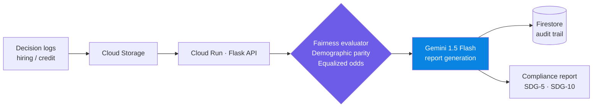

 

---

## 👋 About

I build **production-deployed AI products on Google Cloud**: not notebooks, live URLs. Focus areas: **LLM cost & latency optimization**, **responsible-AI / bias auditing**, and **multilingual civic-tech decision systems**.

|   |   |
|---|---|
| 🎓 | B.Tech CSE '28 · DVR & Dr. HS MIC College of Technology |
| 🌟 | Google Gemini Student Ambassador (2026) |
| 🧪 | Data Analyst Intern, Bluestock Fintech (Sep–Oct 2026) |
| 🎯 | Seeking **SWE · Cloud · DevOps internships** · remote or relocation · available immediately |
| 📍 | Vijayawada, India · IST (UTC+5:30) |

---

## 📊 At a glance

| 🚀 **4** | 🏆 **13+** | ⚡ **~74%** | 🧪 **37** |
|:---:|:---:|:---:|:---:|
| Live Deployed AI Products | hackathons | prompt-token reduction (TokenFlow, own benchmark) | passing tests (CivicPulse scoring engine) |

---

## 🚀 Featured projects

<table>
<tr>
<td width="50%" valign="top">

### 🔍 [BiasGuard AI](https://github.com/NaniToka/unbiased-ai-decision)
**Forensic bias auditor for hiring & credit-scoring decisions.**
Streams decision logs through demographic-parity + equalized-odds checks; Gemini 1.5 Flash generates compliance reports mapped to UN SDG-5 & SDG-10 in **under 30 s**. Built solo for Google Solution Challenge 2026.

`Vertex AI` `Gemini` `Flask` `Firestore` `Cloud Run` `Docker`

[**▶ Live demo**](https://biasguard-rzpoqg6s6a-uc.a.run.app) · [Code](https://github.com/NaniToka/unbiased-ai-decision)

</td>
<td width="50%" valign="top">

### ⚡ [TokenFlow AI](https://github.com/NaniToka/TokenFlow-AI)
**LLM middleware that cuts prompt cost.**
Gemini `text-embedding-004` vectors + exponential recency-decay compression before each completion call, achieving **~74% less prompt-token overhead** (own benchmark).

`FastAPI` `Gemini 1.5 Flash` `React 18` `Render`

[**▶ Live demo**](https://tokenflow-ai.onrender.com) · [API docs](https://tokenflow-ai.onrender.com/docs) · [Code](https://github.com/NaniToka/TokenFlow-AI)

</td>
</tr>
<tr>
<td width="50%" valign="top">

### 🏛️ [CivicPulse AI](https://github.com/NaniToka/civicpulse-ai)
**Multilingual civic decision-intelligence layer.**
Gemini detects language and categorizes citizen complaints; a deterministic 4-factor scoring engine (demand 35 · infra gap 25 · vulnerability 20 · investment overlap 20) ranks priorities. **37 pytest tests.**

`FastAPI` `React` `TypeScript` `Vite` `Gemini`

[**▶ Live demo**](https://civicpulse-ai-frontend.onrender.com/) · [Code](https://github.com/NaniToka/civicpulse-ai)

</td>
<td width="50%" valign="top">

### 🗳️ [VoteWise AI](https://votewise-ai-auoj3wixvq-uc.a.run.app)
**Nonpartisan voter-readiness assistant for first-time voters.**
Deterministic decision-tree engine + Gemini-powered Q&A, containerized on Cloud Run. Built for PromptWars.

`React` `TypeScript` `Gemini` `Docker` `Cloud Run`

[**▶ Live demo**](https://votewise-ai-auoj3wixvq-uc.a.run.app)

</td>
</tr>
</table>

<b>More projects</b>

- 📈 **Mutual Fund Analytics Platform**: 9-table SQLite star schema (86,000+ rows), CAGR / Sharpe / Sortino / Alpha-Beta / VaR / CVaR in a 4-page Streamlit dashboard *(Bluestock capstone)*
- 🏛️ **JanVoice AI**: role-based grievance portals for citizens, MPs and admins with Gemini daily constituency briefings · [Live](https://spontaneous-raindrop-8a7198.netlify.app/dashboard)

---

## 🏗️ How BiasGuard works

---

## 🛠️ Tech stack

**AI/ML:** Gemini API · Vertex AI · embeddings · prompt engineering · fairness metrics  
**Cloud/DevOps:** Cloud Run · Docker · Render · Cloud Storage · Firestore · CI-ready containers  
**Data:** Python · Pandas · SQL · SQLAlchemy · Streamlit

---

## 💼 Experience & recognition

- 🌟 **Google Gemini Student Ambassador**, Google India · May 2026 – present · AI workshops & developer sessions on campus
- 🧪 **Data Analyst Intern**, Bluestock Fintech · Sep–Oct 2026 · end-to-end mutual-fund analytics pipeline, live AMFI NAV integration
- 🏆 **Google Solution Challenge 2026**: BiasGuard AI (solo)
- 🏆 **PromptWars Virtual**: Challenge 3, **Top 400**
- 🏆 **Anvil @ Ascent 2026** (Scaler School of Technology): Grand Finale qualifier
- 💼 **Forage simulations:** JPMorgan (Software Engineering) · Walmart Global Tech (Advanced SWE) · Tata iQ (GenAI Analytics)

<b>Certifications</b>

| Certification | Issuer | Verify |
|---|---|---|
| Google AI Essentials | Google / Coursera | [Verify](https://www.coursera.org/account/accomplishments/specialization/HAXF8PBC6D2I) |
| Claude Code in Action | Anthropic | [Verify](https://verify.skilljar.com/c/e8sdwwdwxw78) |
| Amrita Agentic Leap 2026 | Amrita Vishwa Vidyapeetham | [Verify](https://certificate.amritauniversity.in/verify/359876) |
| Google Cloud Gen AI Academy APAC, Cohort 3 | Google Cloud × Hack2skill | [Verify](https://certificate.hack2skill.com/verify/2026H2S09GCGENAIAPACC3-P00601) |
| PromptWars Virtual, Challenge 1 | Google for Developers | [Verify](https://certificate.hack2skill.com/verify/2026H2S04PWVCHL1-A00285) |
| Build with AI Bootcamp, Chennai | Google for Developers | [Verify](https://certificate.hack2skill.com/verify/2026H2S08BWAICHN-P00569) |
| Google Solution Challenge 2026 | Google × Hack2Skill | [Verify](https://certificate.hack2skill.com/verify/2026H2S07SCBWAI-PS06834) |
| AWS Solutions Architect – Associate | AWS | *In progress* |

---

## 📈 GitHub activity

---

### 📬 Let's build something

**Open to SWE / Cloud / DevOps internships.** I reply fast.

